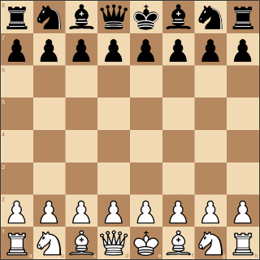

# Bluemix Chess

Sample application demonstrating how to expose a Linux application as a service on a Docker container and consume the service with a front-end JavaScript application. Allows you the opportunity to play chess against [Stockfish](https://stockfishchess.org/), one of the strongest chess engines available today.

Stockfish runs on a Docker container on IBM Containers and is exposed via WebSockets, while the JavaScript UI is served via [http-server](https://github.com/indexzero/http-server) on the [Bluemix Node.js Buildpack](https://developer.ibm.com/bluemix/2015/06/15/bluemix-node-js-buildpack-update/) and runs client-side in the browser.

You can play with a running instance of the application at [http://bluemixchess.mybluemix.net/](http://bluemixchess.mybluemix.net/).

Use the handy button below to fork the project and deploy an instance to your Bluemix space. Note that the Deploy to Bluemix process builds and deploys both a Docker image and a Node.js application, so the deployment process may take up to 20 minutes.

## Dependencies
This project depends on the following third-party libraries.

##### JavaScript Application
* [JSON 3 3.3.2](https://github.com/bestiejs/json3)
* [jQuery 2.1.4](https://github.com/jquery/jquery)
* [sockjs-client 1.0.3](https://github.com/sockjs/sockjs-client)
* [chess.js 0.9.1](https://github.com/jhlywa/chess.js)
* [chessboard.js 0.3.0](http://chessboardjs.com/)
* [http-server 0.8.4](https://github.com/indexzero/http-server)

##### Docker Image
* [Stockfish 6](https://stockfishchess.org/)
* [websocketd](http://websocketd.com/)

## License
This project is made available under the MIT license. Please see License.txt for details.
